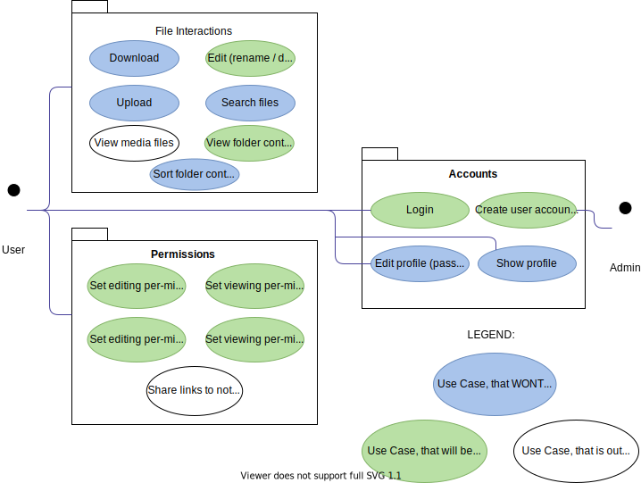

WIP

## Table of contents
- [Table of contents](#table-of-contents)
- [Introduction](#1-introduction)
    - [Purpose](#11-purpose)
    - [Scope](#12-scope)
    - [Definitions, Acronyms and Abbreviations](#13-definitions-acronyms-and-abbreviations)
    - [References](#14-references)
    - [Overview](#15-overview)
- [Overall Description](#2-overall-description)
    - [Vision](#21-vision)
    - [Use Case Diagram](#22-use-case-diagram)
	- [Technology Stack](#23-technology-stack)
- [Specific Requirements](#3-specific-requirements)
    - [Functionality](#31-functionality)
    - [Usability](#32-usability)
    - [Reliability](#33-reliability)
    - [Performance](#34-performance)
    - [Supportability](#35-supportability)
    - [Design Constraints](#36-design-constraints)
    - [Online User Documentation and Help System Requirements](#37-on-line-user-documentation-and-help-system-requirements)
    - [Purchased Components](#purchased-components)
    - [Interfaces](#39-interfaces)
    - [Licensing Requirements](#310-licensing-requirements)
    - [Legal, Copyright And Other Notices](#311-legal-copyright-and-other-notices)
    - [Applicable Standards](#312-applicable-standards)
- [Supporting Information](#4-supporting-information)

## 1. Introduction

### 1.1 Purpose
This Software Requirements Specification (SRS) describes all specifications for the application "FileFighter". It includes an overview about this project and its vision, detailed information about the planned features and boundary conditions of the development process.

### 1.2 Scope
The project is going to be realized as an webapp and backend services, that each user can setup with one single script for them self.  
  
Actors of this App can be have different roles like user and administrator.  
  
Planned Subsystems are: 
* Account System:  
Each users will have an account to identify and get access to files.
* Files System:
Users will be able to store files (upload and download).
* Permissions System:
For each file/folder the owner will be able to authorize other users to see or modify files.

### 1.3 Definitions, Acronyms and Abbreviations

| Abbreviation | Explanation                            |
| ----------- | -------------------------------------- |
| SRS         | Software Requirements Specification    |
| UC          | Use Case                               |
| n/a         | not applicable                         |
| tbd         | to be determined                       |
| UCD         | overall Use Case Diagram               |
| FAQ         | Frequently asked Questions             |

### 1.4 References

| Title                                                              | Date       | Publishing organization   |
| -------------------------------------------------------------------|:----------:| ------------------------- |
| [FileFighter Blog](https://filefighter.github.io/)                 | 13.10.2020 | FileFighter               |
| [GitHub](https://github.com/FileFighter)                           | 13.10.2020 | FileFighter               |

### 1.5 Overview
The following chapter provides an overview of this project with vision and Overall Use Case Diagram. The third chapter (Requirements Specification) delivers more details about the specific requirements in terms of functionality, usability and design parameters. Finally there is a chapter with supporting information. 
    
## 2. Overall Description

### 2.1 Vision
FileFighter is an easy to use and even easier to setup home NAS.  
"NAS" stands for "Network-Attached-Storage", commonly known NAS are applications like [Dropbox](https://www.dropbox.com/){:target="_blank"} and [Nextcloud](https://nextcloud.com/){:target="_blank"}. We want to provide a stable storage solution for each house hold.  
Our solution is developed with families in mind, which want to use their own NAS, but are afraid of technical as well as security issues.

We are upset about Dropbrox / Google Drive and all other large free services logging all our Data. Therefore, we will create our own.
Luckily you don't have to do the same. You can easily use our software and set up your own instance of the FileFighter-Cloud! 
Because out application will be open source only, you can checkout our code. You will see that we removed all kinds of data-collecting or spying software from dependencies and of course our own code.
We will guarantee that no data will collected by us or other companies. You can enjoy the absolute control about your files as you choose where the servers will be running, and where the files will be stored. You could even run everything on a [Raspberry Pi](https://www.raspberrypi.org/){:target="_blank"} in your local network.
Talking about security, all of your files will be only accessible with a password.

### 2.2 Use Case Diagram

<figure>
  
</figure>

<!-- 
We separated the use cases in the ones facing the normal user and the ones only important for the admin.
The admin will be responsible for creating all user accounts, the users them self will then be able to change some of their information like password and username. 

For file interaction we have the basic use cases of viewing folder contents and be able to rename or delete files. The (technical) more advanced use cases are uploading, downloading and searching for files. One potential feature would be support for different media types like videos and music.

To organize the permissions for files the users will be able to set view or editing permission for user or groups of users.

 -->

### 2.3 Technology Stack
The technologies we use are:

- RestApi:
    - Maven and Springboot
    - MongoDB Database

- Frontend:
    - React JS webapp

- IDE:
    - IntelliJ and VS Code

- Project Management:
    - YouTrack
    - GitHub
    - Discord
    - CryptPad

- Deployment:
    - Github Actions 
    - Docker
    - Shell scripts
    
- Testing:
    - Mockito
    - JUnit
    - [CodeCov.io](https://codecov.io/)
    - Jacoco

## 3. Specific Requirements

### 3.1 Functionality
This section will explain the different use cases, you could see in the Use Case Diagram, and their functionality.
Until December we plan to implement:
 * 3.1.1 Login
 * 3.1.2 Create user accounts
 * 3.1.3 View folder contents
 * 3.1.4 Edit (rename/delete) files
 * 3.1.5 Edit permission (viewing or editing) of files for users or groups
 * 3.1.6 Sort folder contents

Until June, we want to implement:
 * 3.1.7 Show own profile
 * 3.1.8 Edit profile information (change password etc.)
 * 3.1.9 Download files
 * 3.1.10 Upload files
 * 3.1.11 Search for files

Use cases that are out of scope:
 * 3.1.12 View media files like audio or video files
 * 3.1.13 Share links to not logged in users

#### 3.1.1 Login

Each users will haven an account they can use to access their files. Therefor they will need to login when using the application. This will be done with username and password. The login will also be cached in the browser, so you don't have to login every time when using the same browser. You will also be able to log out.

#### 3.1.2 Create user accounts

To register an account the administrator will have to create one. The administrator will be able to choose name and group of the new account.

#### 3.1.3 View folder contents

The users will see all the files and subfolders he can access. He will also be able to navigate the folder structure.

#### 3.1.4 Edit (rename/delete) files

The user will then be able to rename or delete the files he is seeing, if he also has edit rights for them.

#### 3.1.5 Edit permission (viewing or editing) of files for users or groups

The owner of a file (the person who uploaded the file) will be able to permit other users to see and also edit his files. This will be managed for folders and their content or individual files. He can permit it to single users or a certain group of users (administrators/internal users/external users).

#### 3.1.6 Sort folder contents

#### 3.1.7 Show own profile

This will be site where the logged in user will be able to see his profile information, like username and the groups he is in.

#### 3.1.8 Edit profile information (change password etc.)

Once an account was created the user should change his password. He will also be able to change his username.

#### 3.1.9 Download files

This is one of the most important use cases of the application. You will be able to download files you are allowed to see with your browser.

#### 3.1.10 Upload files

The same way you can download files you will also be able to upload files in places you are allowed to. This way you can also overwrite files.

#### 3.1.11 Search for files

You will be able to search for files with a specific name within all the files you are allowed to view.

### 3.2 Usability

We want our application to be easy to setup and also easy to use. The user interface should be intuitive and self-explanatory. It should be close to different filesystem browsers you can find on operation systems.
Setting up the application should be easy for everyone who has some experience with computers and servers. The installation will be done by a single shell script and require docker.

### 3.3 Reliability

The provided software should be stable, during the development process we will always provide two version, one that should be stable and one that already includes the latest features.

#### 3.3.1 Availability

### 3.4 Performance

### 3.5 Supportability

### 3.6 Design Constraints

### 3.7 On-line User Documentation and Help System Requirements

### 3.8 Purchased Components

### 3.9 Interfaces

#### 3.9.1 User Interfaces

#### 3.9.2 Hardware Interfaces

#### 3.9.3 Software Interfaces

#### 3.9.4 Communication Interfaces

### 3.10 Licensing Requirements

### 3.11 Legal, Copyright, and Other Notices

### 3.12 Applicable Standards

## 4. Supporting Information
